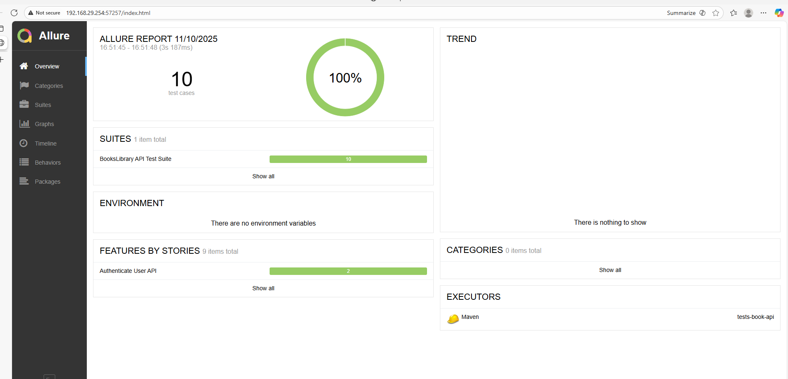

# Book API Automation Framework

This project is a **REST API automation testing framework** built using **Java**, **TestNG**, and **RestAssured**.  
It validates CRUD operations, authentication, and schema validation for the Books Library API.

---

## 🧩 Project Structure

```
tests-book-api/
├── pom.xml                          # Maven project descriptor
├── src
│   ├── main
│   │   └── java
│   │       ├── objectmapper/        # Request/response POJOs
│   │       │   ├── AuthenticateUser.java
│   │       │   └── CreateBook.java
│   │       └── utils/               # Core utilities (clients, base classes, retry, schema validation)
│   │           ├── BooksLibraryApiClient.java
│   │           ├── JsonSchemaValidator.java
│   │           ├── RetryListner.java
│   │           ├── TestBase.java
│   │           └── TestDataProvider.java
│   └── test
│       └── java
│           ├── auth/                # Authentication tests
│           │   └── Test_Auth.java
│           ├── book/                # CRUD tests for books
│           │   └── Test_CRUD.java
│           └── validation/          # JSON schema validation tests
│               └── Test_Schema.java
└── src/test/resources/
    └── configuration.properties     # Environment configuration
    └── Urls.json                    # URL's placeholder         
    
```
## Why the framework/structure is choosen

- **Modular Design => Components(API client, schema validator, test runner) are decoupled** 
- **Payloads, configs, and schemas are organized by environment and endpoint, allowing easy extension to new APIs or test cases**
- **Dynamic Configuration Management => Environment-specific folders (local, qa, prod) allow seamless switching without code changes,Supports future environments by simply adding new folders and config files**
- **Supports tagging and grouping of tests into Smoke, Regression, and custom suites.**
- **Generates rich HTML reports with step-level visibility.**
- **The framework includes a Retry Handler to recover from flaky test/network failures in API communication**

## you improve with more time

- **Include Heath Check In Base Class => Execute Tests Only If Health Check Passes**
- **Move Login To Base Class Such That Token Is Always Available For API Tests**
- **Add Custom Test Listener For Better Handling of tests**
- **Create/Report Bug When Test Fails Automatically**
- **Include Logs To The Report**
- **Improve Error Handling And TestData Provider With Dynamic Handling**
---

## ⚙️ Prerequisites

Make sure you have the following installed:

- **Java 17+**
- **Maven 3.8+**
- **Books api up and running in local**
---

## 🏗️ Setup Instructions

1. **Clone the project**
   ```bash
   git clone <repository-url>
   cd assignment
   ```

2. **Install dependencies and execute tests**
   ```bash
   mvn clean install
   ```
3. **Generate allure report**
   ```bash
   mvn allure:serve
   ```
4. **Report Will Open In Browser Once Execution Completes**
   
---

## 📁 Output Locations

| Type              | Location                        |
|-------------------|---------------------------------|
| Allure results    | `target/allure-results/`        |

---

---

**Author:** Yetendra Doddi  
**Framework:** Java + Maven + TestNG + RestAssured  
**Purpose:** Validate Books Library REST API functionality and schema
